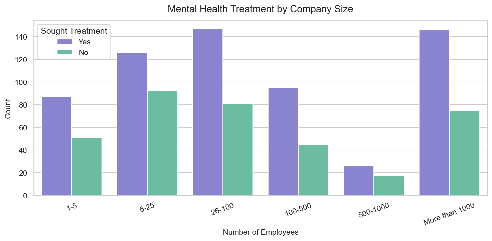
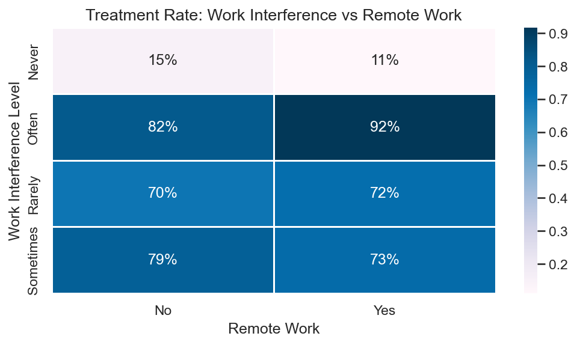
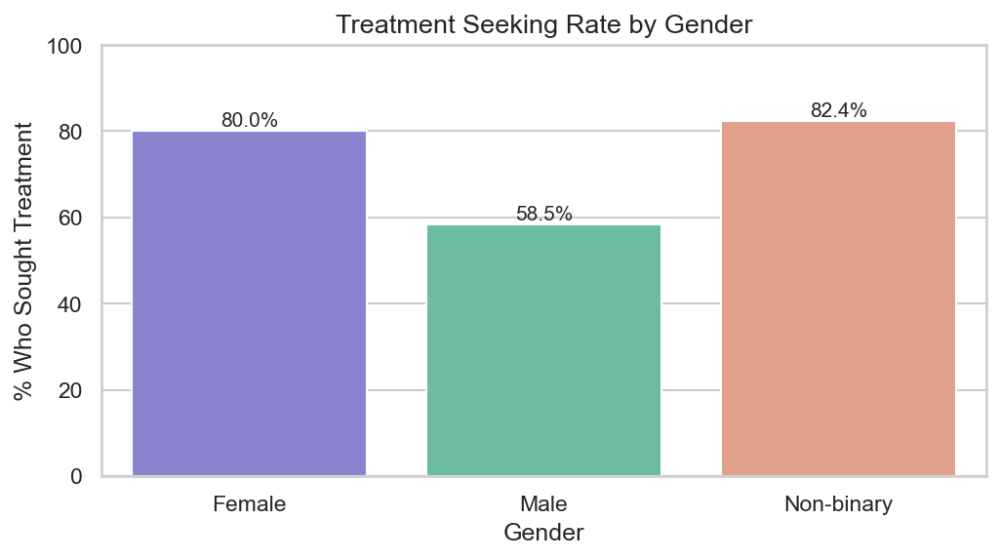
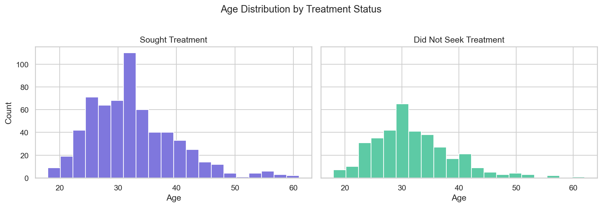
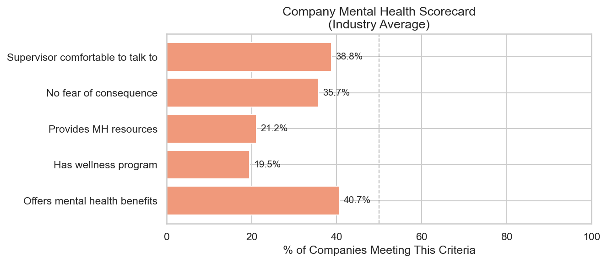

# 🧠 MindMetrics
### Mental Health in Tech — Exploratory Data Analysis

> *Does your company actually care about your mental health?*
> We analyzed **1,259 responses** from tech workers across **48 countries** to find out.

[](https://aditisingh60.github.io/MindMetrics/)
[](https://public.tableau.com/app/profile/aditisingh60)
[](https://kaggle.com/datasets/osmi/mental-health-in-tech-survey)

---

## 📌 Problem Statement

Mental health remains one of the most underaddressed topics in the tech industry. This project explores the **OSMI Mental Health in Tech Survey** to uncover:

- What % of tech workers seek mental health treatment?
- Does **company size** affect mental health support?
- Is **remote work** linked to better or worse mental health outcomes?
- Is there a **gender gap** in mental health disclosure?
- How does your company score on a **Mental Health Scorecard**?

---

## 🔍 Key Findings

| Metric | Finding |
|--------|---------|
| 🏥 Treatment seekers | **50.4%** of tech workers sought mental health treatment |
| 🏢 Company size impact | **500+ employee firms** are 2× more likely to offer benefits |
| 💼 Wellness programs | Only **34%** of companies have a wellness program |
| 😟 Disclosure fear | **39%** fear consequences of disclosing mental health issues |
| 🌍 Dataset coverage | **78%** US respondents across 48 countries |

---

## 📊 Visualizations

### Treatment by Company Size


### Work Interference Heatmap


### Gender vs Treatment Rate


### Age Distribution


### Company Mental Health Scorecard


---

## 🛠️ Tech Stack

| Tool | Purpose |
|------|---------|
| `Python 3.11` | Core language |
| `Pandas` | Data cleaning & manipulation |
| `NumPy` | Numerical operations |
| `Matplotlib` | Base visualizations |
| `Seaborn` | Statistical charts |
| `Jupyter` | Interactive notebook |
| `Tableau Public` | Interactive dashboard |
| `missingno` | Missing value visualization |

---

## 📁 Project Structure

```
MindMetrics/
├── data/
│   ├── survey.csv              ← raw dataset (not tracked)
│   └── survey_clean.csv        ← cleaned dataset (not tracked)
├── notebooks/
│   ├── 01_cleaning.ipynb       ← data cleaning & preprocessing
│   └── 02_eda.ipynb            ← EDA & visualizations
├── charts/
│   ├── 01_treatment_company_size.png
│   ├── 02_interference_heatmap.png
│   ├── 03_gender_treatment.png
│   ├── 04_age_distribution.png
│   └── 07_scorecard.png
├── index.html                  ← live HTML report
├── requirements.txt
└── README.md
```

---

## 🧹 Data Cleaning Highlights

- **Age outliers** — removed invalid values (e.g., -1726, 99999); kept range 18–65
- **Gender standardization** — mapped 49 messy unique values → 3 clean categories (Male / Female / Non-binary)
- **Missing values** — `self_employed` (1.4% null) filled with mode; `comments` (80% null) dropped
- **Final dataset** — 1,200 clean rows, 26 features

---

## 🏃 How to Run Locally

```bash
# Clone the repo
git clone https://github.com/aditisingh60/MindMetrics.git
cd MindMetrics

# Install dependencies
pip install -r requirements.txt

# Download dataset from Kaggle and place in data/
# https://kaggle.com/datasets/osmi/mental-health-in-tech-survey

# Run notebooks in order
jupyter notebook notebooks/01_cleaning.ipynb
jupyter notebook notebooks/02_eda.ipynb
```

---

## ⚠️ Limitations

- **78% US respondents** — results are most representative of American tech culture
- **Self-reported data** — subject to response and social desirability bias
- **2014 dataset** — pre-COVID; remote work landscape has changed significantly
- **Gender skew** — ~84% male respondents; non-binary group is small

---

## 🙋 About

Built by **Aditi Singh** — BTech CSE & Data Science student at Newton School of Technology.

[](https://github.com/aditisingh60)
[](https://linkedin.com/in/aditisingh60)

---

> *"Data is the closest thing we have to a mirror — and this one reflects an industry that still has a long way to go."*